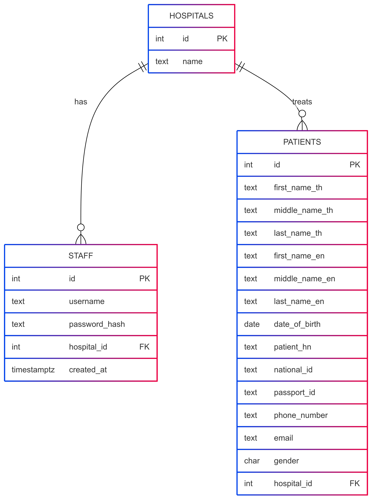

# Hospital API – Middleware Proof‑of‑Concept

Small, self‑contained stack (Go + Gin + Postgres + Nginx) that lets hospital
staff log in and search for patient records scoped to their own hospital.

---

## Tech stack

| Layer            | Choice                                 |
| ---------------- | -------------------------------------- |
| Language         | Go 1.23                                |
| Web framework    | Gin                                    |
| Database         | Postgres 16                            |
| Container        | Docker / docker‑compose                |
| Reverse proxy    | Nginx 1.25                             |
| Testing          | Go’s `testing` pkg + testcontainers‑go |
| Schema migration | goose                                  |

---

## Project structure

```

.
├── cmd/ # main entry‑point
│   └── main.go
├── internal/
│   ├── config/ # env loader
│   ├── handler/ # HTTP handlers + tests
│   ├── middleware/ # JWT auth
│   ├── model/ # DB/domain structs
│   ├── repository/ # SQL access
│   ├── service/ # business logic
│   ├── router/ # Gin route wiring
│   └── testutil/ # test helpers (DB, router, JWT key)
├── migrations/
│   └── 001_create_tables.sql
├── nginx/
│   └── nginx.conf
├── Dockerfile
├── docker-compose.yml
└── README.md

```

---

## Quick start

```bash
# 1. clone
git clone https://github.com/Zin-Theint/hospital-api.git
cd hospital-api

# 2. build & run full stack
docker compose up --build -d

# 3. (optional) seed a demo patient
docker compose exec db psql -U api -d hospital \
  -c "INSERT INTO patients(first_name_en,last_name_en,hospital_id,national_id,date_of_birth) \
      VALUES ('John','Doe',1,'1234567890123','1990-05-01');"

# 4. create staff & log in
curl -X POST http://localhost/staff/create \
     -H 'Content-Type: application/json' \
     -d '{"username":"alice","password":"pass123","hospital":1}'

TOKEN=$(curl -s -X POST http://localhost/staff/login \
        -H 'Content-Type: application/json' \
        -d '{"username":"alice","password":"pass123"}' | jq -r .token)

# 5. search patient (path-param version)
curl -H "Authorization: Bearer $TOKEN" \
     http://localhost/patient/search/1234567890123
```

> **Ports**
>
> - Nginx → `http://localhost` (80)
> - Gin inside container on 8080 (proxied)
> - Postgres on host `localhost:5432` (`api:api_pw@hospital`)

Environment variables (see `docker-compose.yml`):

| Var          | Default                          | Purpose         |
| ------------ | -------------------------------- | --------------- |
| `DB_DSN`     | postgres DSN injected by compose | DB connection   |
| `PORT`       | `8080`                           | Gin listen port |
| `JWT_SECRET` | `dev-secret-change-me`           | HMAC key        |

---

## API specification

| Endpoint                 | Method | Auth       | Request                                                                                                                                      | Response        |
| ------------------------ | ------ | ---------- | -------------------------------------------------------------------------------------------------------------------------------------------- | --------------- |
| **/staff/create**        | POST   | –          | `{"username","password","hospital"}`                                                                                                         | `201 {"id"}`    |
| **/staff/login**         | POST   | –          | `{"username","password"}`                                                                                                                    | `200 {"token"}` |
| **/patient/search/{id}** | GET    | Bearer JWT | path `id` = **national_id OR passport_id**                                                                                                   | `200 Patient`   |
| **/patient/search**      | GET    | Bearer JWT | Any of: `national_id`, `passport_id`, `first_name_en`, `first_name_th`, `middle_name`, `last_name`, `phone_number`, `email`, `date_of_birth` | `200 [Patient]` |

```jsonc
// Patient JSON schema
{
  "id": 1,
  "first_name_th": "จอห์น",
  "middle_name_th": null,
  "last_name_th": "โด",
  "first_name_en": "John",
  "middle_name_en": null,
  "last_name_en": "Doe",
  "date_of_birth": "1990-05-01T00:00:00Z",
  "patient_hn": "HN001",
  "national_id": "1234567890123",
  "passport_id": "P9876543",
  "phone_number": "0812345678",
  "email": "john@example.com",
  "gender": "M",
  "hospital_id": 1
}
```

---

## ER diagram

## 

## Running tests

```bash
# Docker must be running for testcontainers
go test ./...
```

The suite:

- Spins a disposable Postgres container
- Applies migration `001_create_tables.sql`
- Exercises happy & sad paths for all endpoints

---

## Maintainer commands

| Action                  | Command                                          |
| ----------------------- | ------------------------------------------------ |
| Rebuild containers      | `docker compose up --build`                      |
| Stop all                | `docker compose down`                            |
| PSQL shell              | `docker compose exec db psql -U api -d hospital` |
| Run migrations manually | `docker compose exec api goose -v up`            |

---
